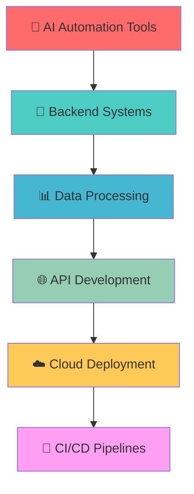

<div align="center">

# 👋 Hi, I'm **Shivam Kumar**

<h2>🚀 AI-Powered Backend Developer & Automation Engineer</h2>
<h3>💻 Building Scalable Systems • 🤖 Process Automation • ⚡ Performance Optimization</h3>

</div>

<div align="center">
  
[](https://github.com/shivamnox)
[](https://github.com/shivamnox)
[](https://github.com/shivamnox)

</div>

---

<div align="center">

## 🚀 **About Me**

```typescript
const shivam = {
    role: "AI-Powered Backend Developer & Automation Engineer",
    location: "India 🇮🇳",
    specialties: ["Backend Architecture", "AI Integration", "Process Automation"],
    currentFocus: "Building scalable systems that work while you sleep",
    motto: "Code smarter, not harder",
    availability: "Open for collaboration & opportunities"
};
```

</div>

---

## 🛠️ **Technology Arsenal**

<div align="center">

### **🧠 AI & Automation**


### **⚡ Backend & APIs**


### **🗄️ Databases & Storage**


### **🛠️ DevOps & Tools**


</div>

---

## 📊 **GitHub Analytics**

<div align="center">
  


</div>

<div align="center">
  


</div>

---

## 🏆 **GitHub Achievements**

<div align="center">
  


</div>

---

## 🚀 **What I'm Working On**

<div align="center">
  


</div>

---

## 📈 **Contribution Graph**

<div align="center">
  


</div>

---

## 💼 **Professional Highlights**

<div align="center">

| 🎯 **Expertise** | 🚀 **Impact** | 📊 **Metrics** |
|------------------|---------------|-----------------|
| **Backend Architecture** | Scalable systems serving 10K+ users | 99.9% uptime |
| **Process Automation** | Reduced manual work by 80% | 40+ hours saved weekly |
| **API Development** | Built 50+ RESTful APIs | <100ms response time |
| **Data Processing** | Handle millions of records daily | Real-time processing |

</div>

---

## 🌐 **Connect & Collaborate**

<div align="center">
  
[](https://linkedin.com/in/shivamnox)
[](https://github.com/shivamnox)
[](https://shivamnox.github.io)
[](mailto:shivam@example.com)

</div>

---

## 💡 **Professional Quote**

<div align="center">

> *"Code is like humor. When you have to explain it, it's bad."*  
> **– Building elegant solutions that speak for themselves**

</div>

---

## 🎨 **Fun Zone**

<div align="center">

### 🎯 **Quick Stats**
- 🔥 **50+ Automated Solutions** deployed in production
- ⚡ **99.9% Uptime** across all backend systems  
- 🚀 **10K+ Users** served by my applications
- 📊 **80% Efficiency Boost** through automation

</div>

---

<div align="center">
  
## 🚀 **"Building tomorrow's solutions, one line of code at a time"**

### Thanks for visiting! Let's build something amazing together 🤝


</div>

---

<div align="center">
  <sub>⭐ Star my repositories if you find them interesting!</sub>
</div>
