# <div align="center"></div>

<div align="center">
  
[](https://github.com/shivamnox)
[](https://github.com/shivamnox)
[](https://github.com/shivamnox)

</div>

---

<div align="center">

## 🚀 **About Me**

```typescript
const shivam = {
    role: "  AI-Powered Backend Developer & Automation Engineer",
    location: "India 🇮🇳",
    specialties: ["  Backend Architecture", "AI Integration", "Process Automation"],
    currentFocus: "Building scalable systems that work while you sleep",
    motto: "Code smarter, not harder",
    availability: "Open for collaboration & opportunities"
};
```

</div>

---

## 🛠️ **Technology Arsenal**

<div align="center">

### **🧠 AI & Automation**


### **⚡ Backend & APIs**


### **🗄️ Databases & Storage**


### **🛠️ DevOps & Tools**


</div>

---

## 📊 **GitHub Analytics**

<div align="center">
  


</div>

<div align="center">
  


</div>

---

## 🏆 **GitHub Trophies**

<div align="center">
  


</div>

---

## 🚀 **What I'm Working On**

```mermaid
graph TD
    A[🤖 AI Automation Tools] --> B[🔧 Backend Systems]
    B --> C[📊 Data Processing]
    C --> D[🌐 API Development]
    D --> E[☁️ Cloud Deployment]
    E --> F[🔄 CI/CD Pipelines]
    
    style A fill:#ff6b6b
    style B fill:#4ecdc4
    style C fill:#45b7d1
    style D fill:#96ceb4
    style E fill:#feca57
    style F fill:#ff9ff3
```

<div align="center">
  


</div>

---

## 📈 **Contribution Graph**

<div align="center">
  


</div>

---

## 💼 **Professional Highlights**

<div align="center">

| 🎯 **Expertise** | 🚀 **Impact** | 📊 **Metrics** |
|------------------|---------------|-----------------|
| **Backend Architecture** | Scalable systems serving 10K+ users | 99.9% uptime |
| **Process Automation** | Reduced manual work by 80% | 40+ hours saved weekly |
| **API Development** | Built 50+ RESTful APIs | <100ms response time |
| **Data Processing** | Handle millions of records daily | Real-time processing |

</div>

---

## 🌐 **Connect & Collaborate**

<div align="center">
  
[](https://linkedin.com/in/shivamnox)
[](https://github.com/shivamnox)
[](https://shivamnox.github.io)
[](mailto:shivam@example.com)

</div>

---

## 💡 **Daily Inspiration**

<div align="center">


</div>

---

## 🎨 **Fun Zone**

<div align="center">

### 🐍 **Watch my contributions get eaten!**


### 🎵 **Currently Coding To**
[](https://open.spotify.com/user/shivamnox)

</div>

---

<div align="center">
  
## 🚀 **"Building tomorrow's solutions, one line of code at a time"**

### Thanks for visiting! Let's build something amazing together 🤝


</div>

---

<div align="center">
  <sub>⭐ Star my repositories if you find them interesting!</sub>
</div>
